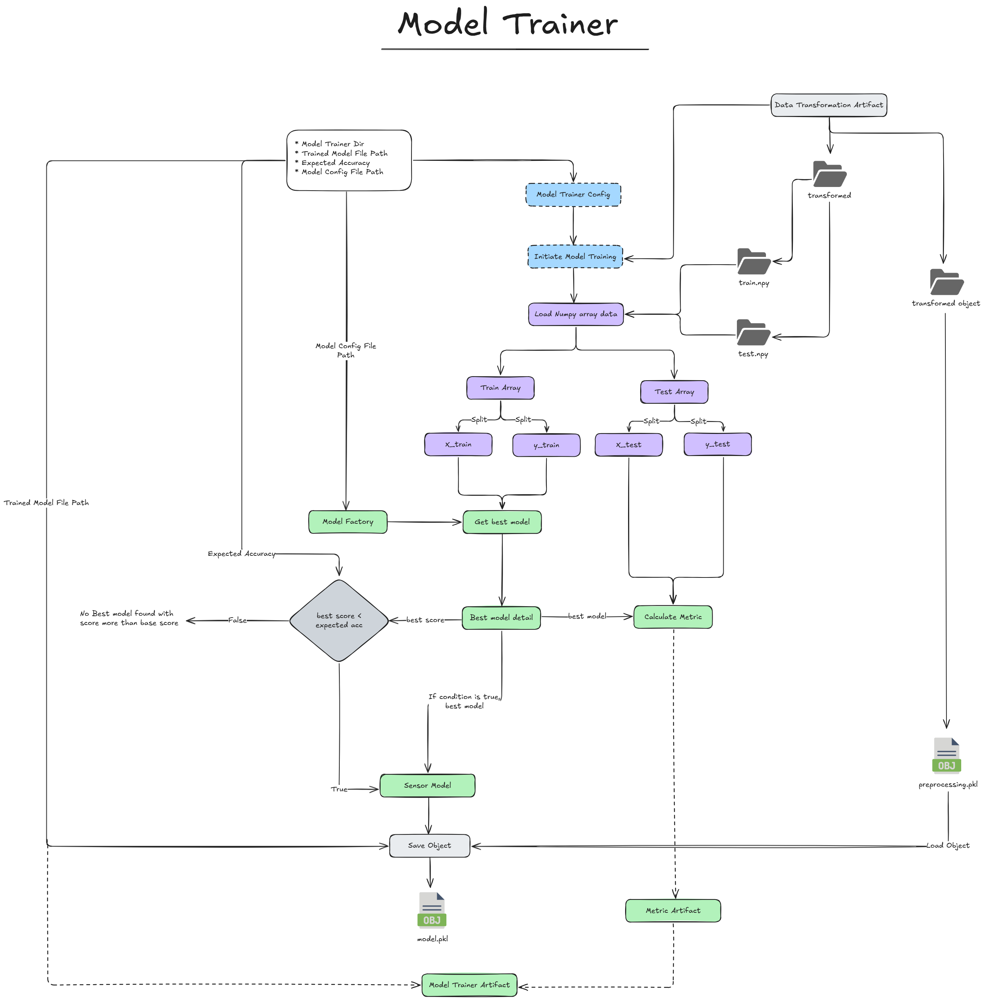

# Network Security Project For Phishing Data

## 1. Overview

This project is a comprehensive machine learning solution for detecting phishing attempts using industry data engineering and MLOps practices. The system implements an end-to-end pipeline that processes phishing data, validates data quality, transforms features, and trains machine learning models with automated deployment capabilities.

The main features include:

- **Data Ingestion**: Automated collection and organization of phishing data from MongoDB

- **Data Validation**: Schema validation and data drift detection using statistical tests

- **Data Transformation**: Advanced feature engineering and preprocessing with KNN imputation

- **Model Training**: Multi-algorithm training with hyperparameter tuning and MLflow tracking

- **CI/CD Pipeline**: Automated deployment using GitHub Actions, AWS ECR, and EC2

- **Real-time Inference**: FastAPI-based web service for real-time phishing prediction

## 2. Architecture

The project follows a modular microservices architecture with cloud-native deployment strategies. The system is designed for scalability, maintainability, and automated operations. Below is the visual representation of the complete ETL pipeline:


**Key Architectural Components:**

- **Data Layer**: MongoDB for data storage with AWS S3 for artifact management
- **Processing Layer**: Modular Python components for each pipeline stage
- **ML Operations**: MLflow and DagsHub integration for experiment tracking
- **Deployment Layer**: Docker containerization with AWS ECR/EC2 deployment
- **API Layer**: FastAPI for real-time inference and web interface

## 3. Features

### 3.1 Data Ingestion

- **MongoDB Integration**: Connects to MongoDB Atlas for data retrieval using pymongo
- **Data Export**: Converts CSV data to JSON format for database storage
- **Feature Store**: Organized data storage in feature store directory
- **Train-Test Split**: Automated 80-20 split for model training and validation


### 3.2 Data Validation

- **Schema Validation**: YAML-based schema validation for data consistency
- **Data Drift Detection**: Statistical drift detection using Kolmogorov-Smirnov test
- **Quality Assurance**: Comprehensive data quality checks and validation reports
- **Automated Logging**: Detailed logging of all validation processes and outcomes


### 3.3 Data Transformation

- **Feature Engineering**: Advanced preprocessing techniques for optimal model performance
- **Missing Value Imputation**: KNN-based imputation for handling missing values
- **Data Standardization**: Preprocessing pipeline using scikit-learn transformers
- **Numpy Array Storage**: Efficient data storage in numpy format for faster processing


### 3.4 Model Trainer

- **Multi-Algorithm Training**: Support for multiple ML algorithms (Random Forest, Gradient Boosting, etc.)
- **Hyperparameter Tuning**: Automated parameter optimization for best performance
- **Model Evaluation**: Comprehensive metrics including F1-score, precision, and recall
- **MLflow Integration**: Complete experiment tracking and model versioning



## 4. Solutions Implemented

### 4.1 MLOps and Experiment Tracking

- **MLflow Integration**: Complete experiment tracking with metrics, parameters, and model artifacts
- **DagHub Integration**: Centralized model registry and collaboration platform
- **Model Versioning**: Automated model versioning and comparison capabilities

### 4.2 Cloud Infrastructure

- **AWS S3 Integration**: Artifact storage and synchronization with S3 buckets
- **AWS ECR**: Container registry for Docker image management
- **AWS EC2**: Production deployment on EC2 instances with auto-scaling capabilities

### 4.3 DevOps and CI/CD

- **GitHub Actions**: Automated CI/CD pipeline with three stages:
  - Continuous Integration: Code linting and unit testing
  - Continuous Delivery: Docker image building and ECR pushing
  - Continuous Deployment: Automated deployment to EC2 instances
- **Docker Containerization**: Multi-stage builds for optimized container images
- **Environment Management**: Secure environment variable handling with GitHub Secrets

### 4.4 Data Engineering

- **MongoDB Atlas**: Cloud database integration with SSL/TLS encryption
- **Data Pipeline Orchestration**: Automated pipeline execution with comprehensive logging
- **Error Handling**: Custom exception handling with detailed error tracking
- **Configuration Management**: YAML-based configuration with environment-specific settings

## 5. Technologies Used

### 5.1 Core Technologies

- **Python 3.10**: Primary programming language with modern features
- **FastAPI**: High-performance web framework for API development
- **Scikit-learn**: Machine learning library for model training and evaluation
- **Pandas & Numpy**: Data manipulation and numerical computing

### 5.2 Database and Storage

- **MongoDB Atlas**: Cloud-based NoSQL database with PyMongo driver
- **AWS S3**: Object storage for artifacts and model persistence
- **YAML**: Configuration and schema definition

### 5.3 MLOps Stack

- **MLflow**: Experiment tracking, model registry, and deployment
- **DagsHub**: Collaborative platform for data science and MLOps
- **Docker**: Containerization for consistent deployments

### 5.4 Cloud and DevOps

- **AWS ECR**: Elastic Container Registry for Docker images
- **AWS EC2**: Compute instances for production deployment
- **GitHub Actions**: CI/CD automation and workflow management
- **AWS CLI**: Command-line interface for AWS services integration

## 6. Setup and Deployment

### 6.1 Local Development

1. **Environment Setup**

   ```bash
   git clone <repository-url>
   cd network-security
   pip install -r requirements.txt
   ```

2. **Environment Variables**

   Create a `.env` file with:

   ```env
   MONGODB_URL_KEY=your_mongodb_connection_string
   MLFLOW_TRACKING_URI=your_mlflow_tracking_uri
   MLFLOW_TRACKING_USERNAME=your_username
   MLFLOW_TRACKING_PASSWORD=your_password
   AWS_ACCESS_KEY_ID=your_aws_access_key
   AWS_SECRET_ACCESS_KEY=your_aws_secret_key
   AWS_REGION=your_aws_region
   ```

3. **Pipeline Execution**

   ```bash
   python main.py  # Run complete training pipeline
   python app.py   # Start FastAPI web service
   ```

### 6.2 GitHub Actions CI/CD

The project includes automated deployment with three stages:

1. **Continuous Integration**: Automated testing and code quality checks
2. **Continuous Delivery**: Docker image building and push to AWS ECR
3. **Continuous Deployment**: Automated deployment to EC2 with zero-downtime updates

### 6.3 AWS Infrastructure Requirements

- **ECR Repository**: For storing Docker images
- **EC2 Instance**: For running the production application
- **S3 Bucket**: Named 'network-security-br' for artifact storage
- **IAM Roles**: Proper permissions for ECR, S3, and EC2 access

## 7. Project Structure

```text
network-security/
├── src/                          # Source code modules
│   ├── components/               # Pipeline components
│   ├── pipeline/                 # Training and batch prediction pipelines
│   ├── entity/                   # Configuration and artifact entities
│   ├── exception/                # Custom exception handling
│   ├── logging/                  # Logging configuration
│   ├── utils/                    # Utility functions and ML operations
│   ├── cloud/                    # AWS S3 synchronization
│   └── constant/                 # Configuration constants
├── artifacts/                    # Training artifacts and outputs
├── data/                         # Raw data storage
├── logs/                         # Application logs
├── model/                        # Trained model storage
├── schema/                       # Data validation schemas
├── templates/                    # HTML templates for web interface
├── .github/workflows/            # CI/CD pipeline configuration
├── requirements.txt              # Python dependencies
├── Dockerfile                    # Container configuration
├── app.py                        # FastAPI web application
└── main.py                       # Training pipeline entry point
```

## 8. API Endpoints

The FastAPI application provides the following endpoints:

- **GET /**: Redirects to API documentation
- **GET /train**: Triggers the complete training pipeline
- **POST /predict**: Accepts CSV file upload for batch prediction
- **GET /docs**: Interactive API documentation (Swagger UI)
